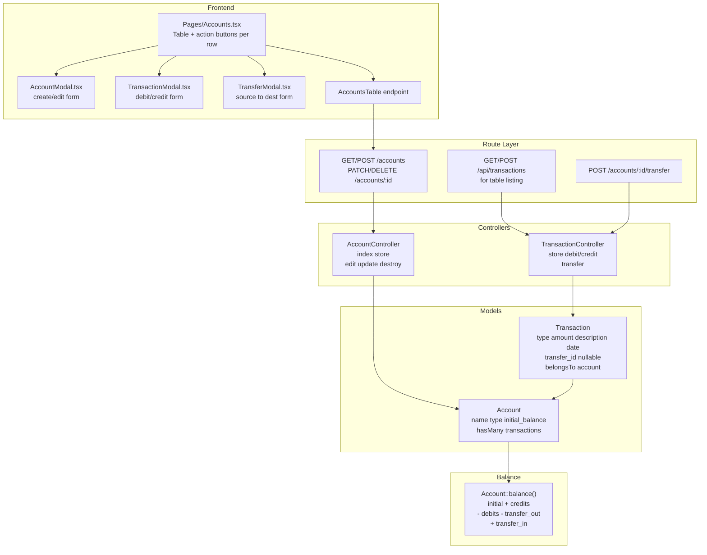

# Accounts & Transactions Design

**Spec**: `.specs/features/accounts-transactions/spec.md`
**Status**: Draft

---

## Architecture Overview

Two-model design: `Account` (financial container with computed balance) and `Transaction` (immutable movement record). Both auto-scoped to workspace via `BelongsToWorkspace` trait. Transfer operation creates 2 linked transactions atomically within a DB transaction.



**Key design decisions:**

| Decision | Choice | Rationale |
|----------|--------|-----------|
| Balance storage | Computed, not stored | Evita inconsistência. `initial_balance + SUM(transactions)`. Sem coluna `balance` na tabela accounts. |
| Amount precision | Integer centavos (bigint) | Evita floating-point. `MoneyInput` já trabalha em centavos. BRL decimal é multiplicado por 100. |
| Transaction immutability | Sem update/delete de transações | Simplifica auditoria e consistência de saldo. Feature futura pode adicionar reversão (estorno). |
| Transfer pair linking | `transfer_id` UUID compartilhado | Duas transações (transfer_out + transfer_in) compartilham o mesmo UUID. Fácil de rastrear. |
| Account type | String visual, sem enum DB | "checking", "savings", "wallet", "investment", "other". Apenas label visual, sem lógica condicional. |
| Transaction listing | API endpoint separado do CRUD de contas | Contas usam Table JSON API. Transações serão listadas via extrato (F07 futuro), mas o endpoint já é criado. |
| Transfer amount > balance | Permitir com confirmação (spec AC-5) | Saldo pode ficar negativo. Confirmação adicional via ConfirmDialog. |

---

## Code Reuse Analysis

### Existing Components to Leverage

| Component | Location | How to Use |
|-----------|----------|------------|
| `BelongsToWorkspace` trait | `app/Models/Concerns/BelongsToWorkspace.php` | Apply to Account + Transaction models. Auto-scopes queries + auto-sets workspace_id on create. |
| `active_workspace()` helper | `app/helpers.php` | Get current workspace for controller logic (balance, validation). |
| `Controller` base | `app/Http/Controllers/Controller.php` | Extend for AccountController + TransactionController. |
| `AuthenticatedLayout` | `resources/js/Layouts/AuthenticatedLayout.tsx` | Wraps Accounts page. Already has sidebar links to /accounts and /transactions. |
| `Table` | `resources/js/Components/ui/Table/Table.tsx` | Accounts list with server-side pagination, sorting, and inline action buttons per row. |
| `FormModal` | `resources/js/Components/ui/Modal/FormModal.tsx` | Create/edit account modal, transaction modal, transfer modal. |
| `ConfirmDialog` | `resources/js/Components/ui/Modal/ConfirmDialog.tsx` | Delete account confirmation, transfer confirmation (negative balance warning). |
| `Button` | `resources/js/Components/ui/Button.tsx` | All action buttons: Nova Conta, Lançar Movimento, Transferir, Editar, Excluir. |
| `TextInput` | `resources/js/Components/ui/Input/TextInput.tsx` | Account name field, transaction description field. |
| `Select` | `resources/js/Components/ui/Input/Select.tsx` | Account type selector, transaction type (Débito/Crédito), destination account selector (transfer). |
| `MoneyInput` | `resources/js/Components/ui/Input/MoneyInput.tsx` | Initial balance (account create), transaction amount, transfer amount. Stores/returns centavos. |
| `DateInput` | `resources/js/Components/ui/Input/DateInput.tsx` | Transaction date field. Defaults to today. |
| `Alert` | `resources/js/Components/ui/Alert.tsx` | Empty state when no accounts exist, error messages. |
| `PageTitle` | `resources/js/Components/layout/PageTitle.tsx` | Accounts page header with "Nova Conta" action button. |
| `Breadcrumbs` | `resources/js/Components/layout/Breadcrumbs.tsx` | Breadcrumb: Dashboard > Contas. |
| `toast` | `resources/js/lib/toast.ts` | Success/error feedback for all actions (create, delete, transaction, transfer). |
| `FontAwesomeIcon` | `resources/js/lib/icons.ts` | Icons for account types, action buttons, alerts. |

### Existing Patterns to Follow

| Pattern | Example | Apply To |
|---------|---------|----------|
| Controller → Inertia render + JSON API | `routes/web.php` (MemberController@index renders page, /api/ui-showcase-table returns JSON) | AccountController@index (renders page) + TransactionController API endpoints |
| Request validation | `InviteMemberRequest`, `UpdateMemberRoleRequest` | `StoreAccountRequest`, `UpdateAccountRequest`, `StoreTransactionRequest`, `TransferRequest` |
| Route → middleware → controller | `auth` + `workspace` groups | All account/transaction routes inside `auth` + `workspace` group |
| Migration structure | `2026_05_05_000001_create_workspaces_table.php` | New account + transaction migrations |
| Test structure | `tests/Feature/Workspace/CreateWorkspaceTest.php` (RefreshDatabase + HTTP assertions) | All account + transaction feature tests |
| Inertia form submission | `CreateWorkspaceModal.tsx` (useForm + post) | Account create/edit, transaction create |
| Modal state management | `Workspace/Members.tsx` (useState for modals) | Account modals: create/edit/delete/transaction/transfer |
| Server-side Table | `UI/Showcase.tsx` (endpoint + columns) | Accounts list table |

### Integration Points

| System | Integration Method |
|--------|-------------------|
| BelongsToWorkspace | `use BelongsToWorkspace` trait on Account + Transaction models. Auto-scopes all queries. |
| workspace_user (auth) | Editor and owner roles can perform all CRUD. No viewer role (deferred D11). Gate: `can:manage-financial-entities`. |
| HandleInertiaRequests | Already shares `workspace` + `workspaces`. No changes needed. Account controllers read workspace from session. |
| routes/web.php | Add `auth` + `workspace` route group for `/accounts` and `/api/accounts`. |
| Sidebar link | `AuthenticatedLayout.tsx` already links to `/accounts`. Update href to use `route('accounts.index')`. |

---

## Data Models

### Account

**Table**: `accounts`
**Columns**:

| Column | Type | Constraints |
|--------|------|-------------|
| id | bigint unsigned | auto-increment, primary |
| workspace_id | bigint unsigned | FK → workspaces(id), onDelete cascade |
| name | string(255) | not null |
| type | string(50) | not null, default 'checking' |
| initial_balance | bigint | not null, default 0 (in cents) |
| created_at | timestamp | |
| updated_at | timestamp | |

```php
// app/Models/Account.php
use App\Models\Concerns\BelongsToWorkspace;

#[Fillable(['name', 'type', 'initial_balance'])]
class Account extends Model
{
    use BelongsToWorkspace;

    public function transactions(): HasMany
    {
        return $this->hasMany(Transaction::class);
    }

    public function balance(): int
    {
        return (int) $this->initial_balance
            + $this->transactions()->where('type', 'credit')->sum('amount')
            - $this->transactions()->where('type', 'debit')->sum('amount')
            - $this->transactions()->where('type', 'transfer_out')->sum('amount')
            + $this->transactions()->where('type', 'transfer_in')->sum('amount');
    }

    public function hasTransactions(): bool
    {
        return $this->transactions()->exists();
    }

    protected function casts(): array
    {
        return [
            'initial_balance' => 'integer',
        ];
    }
}
```

**Relationships**:
- `transactions()` — HasMany Transaction
- Inversely, Transaction belongsTo Account

**Type values (visual only)**:
| Value | Label |
|-------|-------|
| `checking` | Conta Corrente |
| `savings` | Poupança |
| `wallet` | Carteira |
| `investment` | Investimento |
| `other` | Outros |

### Transaction

**Table**: `transactions`
**Columns**:

| Column | Type | Constraints |
|--------|------|-------------|
| id | bigint unsigned | auto-increment, primary |
| workspace_id | bigint unsigned | FK → workspaces(id), onDelete cascade |
| account_id | bigint unsigned | FK → accounts(id), onDelete cascade |
| type | string(20) | not null, values: debit, credit, transfer_out, transfer_in |
| amount | bigint | not null, > 0 (in cents) |
| description | string(255) | not null |
| date | date | not null, default today |
| transfer_id | string(36) | nullable, UUID v4 for transfer pairs |
| created_at | timestamp | |
| updated_at | timestamp | |

```php
// app/Models/Transaction.php
use App\Models\Concerns\BelongsToWorkspace;

#[Fillable(['account_id', 'type', 'amount', 'description', 'date', 'transfer_id'])]
class Transaction extends Model
{
    use BelongsToWorkspace;

    public function account(): BelongsTo
    {
        return $this->belongsTo(Account::class);
    }

    public function isTransfer(): bool
    {
        return in_array($this->type, ['transfer_out', 'transfer_in']);
    }

    protected function casts(): array
    {
        return [
            'amount' => 'integer',
            'date' => 'date',
        ];
    }
}
```

**Relationships**:
- `account()` — BelongsTo Account
- Transfer pairs are linked by `transfer_id`, not a separate relationship (queryable by `where transfer_id = ?`).

**Type values**:
| Value | Label | Effect on Account Balance |
|-------|-------|--------------------------|
| `debit` | Débito | Reduces |
| `credit` | Crédito | Increases |
| `transfer_out` | Transferência (saída) | Reduces |
| `transfer_in` | Transferência (entrada) | Increases |

---

## Backend Components

### Controller: `AccountController`

- **Purpose**: CRUD de contas financeiras. Renderiza página de listagem + processa ações.
- **Location**: `app/Http/Controllers/AccountController.php`
- **Interfaces**:
  - `index(Request $request): Response` — renderiza `Accounts` page (Inertia). Opcional: passa contas como prop para pré-render inicial da table.
  - `store(StoreAccountRequest $request): RedirectResponse` — cria conta com workspace_id auto-set pelo trait.
  - `update(UpdateAccountRequest $request, Account $account): RedirectResponse` — atualiza nome e tipo (saldo NÃO é editável).
  - `destroy(Account $account): RedirectResponse` — exclui conta se não tiver transações. Retorna 422 se tiver.
- **Dependencies**: Account model (BelongsToWorkspace auto-scopes)
- **Reuses**: Controller base, active_workspace() helper
- **Authorization**: Gate `manage-financial-entities` (owner + editor). Aplicado via middleware nas rotas.

**Route params**:
- `{account}` é resolvido via route-model binding com BelongsToWorkspace scope (auto 404 se conta de outro workspace).

### Controller: `TransactionController`

- **Purpose**: Cria transações de débito/crédito e transferências. API endpoint para listagem de transações por conta (usado pelo Table).
- **Location**: `app/Http/Controllers/TransactionController.php`
- **Interfaces**:
  - `store(StoreTransactionRequest $request, Account $account): RedirectResponse` — cria transação de débito ou crédito na conta. Valida que tipo é debit/credit (não transfer).
  - `transfer(TransferRequest $request, Account $account): RedirectResponse` — cria transferência de $account (origem) para conta destino. DB transaction: 2 INSERT com mesmo transfer_id UUID.
  - `apiIndex(Account $account, Request $request): JsonResponse` — listagem paginada de transações da conta para Table component (uso futuro F07, mas infraestrutura já criada).
- **Dependencies**: Account, Transaction models
- **Reuses**: Controller base, DB::transaction() para atomicidade
- **Authorization**: Gate `manage-financial-entities`

### Requests

#### `StoreAccountRequest`

- **Purpose**: Valida criação de conta.
- **Location**: `app/Http/Requests/StoreAccountRequest.php`
- **Rules**:
  - `name` — required, string, max:255
  - `type` — required, string, in:checking,savings,wallet,investment,other
  - `initial_balance` — required, integer, min:0 (cents)

#### `UpdateAccountRequest`

- **Purpose**: Valida edição de conta (nome e tipo apenas).
- **Location**: `app/Http/Requests/UpdateAccountRequest.php`
- **Rules**:
  - `name` — required, string, max:255
  - `type` — required, string, in:checking,savings,wallet,investment,other

#### `StoreTransactionRequest`

- **Purpose**: Valida criação de transação de débito/crédito.
- **Location**: `app/Http/Requests/StoreTransactionRequest.php`
- **Rules**:
  - `type` — required, string, in:debit,credit
  - `amount` — required, integer, min:1 (cents, > 0)
  - `description` — required, string, max:255
  - `date` — nullable, date, before_or_equal:today (or no constraint for future dates per spec)

#### `TransferRequest`

- **Purpose**: Valida transferência entre contas.
- **Location**: `app/Http/Requests/TransferRequest.php`
- **Rules**:
  - `destination_account_id` — required, exists:accounts,id (workspace-scoped via BelongsToWorkspace). Must not equal source account id.
  - `amount` — required, integer, min:1
  - `date` — nullable, date
  - `description` — nullable, string, max:255
- **Custom validation**:
  - `destination_account_id` != source account id (via Rule::notIn or custom rule)
  - Destination account must belong to same workspace (handled by BelongsToWorkspace scope on exists rule via custom validation)

### Gate: `manage-financial-entities`

Register in `AppServiceProvider@boot`:

```php
Gate::define('manage-financial-entities', function (User $user) {
    $workspace = active_workspace();
    if (!$workspace) return false;
    $role = $user->workspaceRole($workspace);
    return in_array($role, ['owner', 'editor']);
});
```

Applied as middleware `can:manage-financial-entities` on all account/transaction routes.

---

## Route Design

### New Routes (insert into existing `auth` + `workspace` group)

```php
use App\Http\Controllers\AccountController;
use App\Http\Controllers\TransactionController;

Route::middleware(['auth', 'workspace'])->group(function () {
    // ... existing routes (dashboard, profile, workspace, switch) ...

    // Accounts
    Route::get('/accounts', [AccountController::class, 'index'])
        ->name('accounts.index')
        ->middleware('can:manage-financial-entities');
    Route::post('/accounts', [AccountController::class, 'store'])
        ->name('accounts.store')
        ->middleware('can:manage-financial-entities');
    Route::patch('/accounts/{account}', [AccountController::class, 'update'])
        ->name('accounts.update')
        ->middleware('can:manage-financial-entities');
    Route::delete('/accounts/{account}', [AccountController::class, 'destroy'])
        ->name('accounts.destroy')
        ->middleware('can:manage-financial-entities');

    // API: Accounts table (server-side)
    Route::get('/api/accounts', [AccountController::class, 'apiIndex'])
        ->name('api.accounts.index')
        ->middleware('can:manage-financial-entities');

    // API: Transactions table for a specific account (future F07)
    Route::get('/api/accounts/{account}/transactions', [TransactionController::class, 'apiIndex'])
        ->name('api.accounts.transactions')
        ->middleware('can:manage-financial-entities');

    // Transaction: Debit/Credit
    Route::post('/accounts/{account}/transactions', [TransactionController::class, 'store'])
        ->name('accounts.transactions.store')
        ->middleware('can:manage-financial-entities');

    // Transfer between accounts
    Route::post('/accounts/{account}/transfer', [TransactionController::class, 'transfer'])
        ->name('accounts.transfer')
        ->middleware('can:manage-financial-entities');
});
```

**Important**: The `apiIndex` method on AccountController returns JSON for the Table component (not Inertia render). It supports query params: `page`, `perPage`, `sort`, `order`, `search`.

### Update Sidebar in AuthenticatedLayout

Replace hardcoded `/accounts` href with `route('accounts.index')`:

```tsx
{
    label: 'Accounts',
    href: route('accounts.index'),
    icon: faBuildingColumns,
    active: route().current('accounts.*'),
},
```

---

## Frontend Components

### Page: `Accounts`

- **Purpose**: Página de listagem de contas com tabela, ações por linha e modais.
- **Location**: `resources/js/Pages/Accounts.tsx`
- **Dependencies**: `AuthenticatedLayout`, `PageTitle`, `Breadcrumbs`, `Table`, `Button`, `AccountModal`, `TransactionModal`, `TransferModal`, `ConfirmDialog`
- **Interfaces**: Receives no special Inertia props (table fetches data via API endpoint).
- **Reuses**: Table padrão (mesma API), padrão de modal state management

**Page structure**:
```
Accounts
├── AuthenticatedLayout
│   ├── Breadcrumbs: [{label: 'Dashboard', href: route('dashboard')}, {label: 'Contas'}]
│   ├── PageTitle: title="Contas", actions={<Button>Nova Conta</Button>}
│   ├── Table: endpoint="/api/accounts", columns=[name, type, balance, actions]
│   │   ├── Coluna "Nome": account.name (sortable)
│   │   ├── Coluna "Tipo": label traduzido do account.type
│   │   ├── Coluna "Saldo Atual": formatado em BRL com cor (verde = positivo, vermelho = negativo)
│   │   │   └── render: MoneyInput.centsToDisplay() ou Intl.NumberFormat
│   │   └── Coluna "Ações": 4 botões inline:
│   │       ├── Button ghost (Lançar Movimento) → abre TransactionModal
│   │       ├── Button ghost (Transferir) → abre TransferModal
│   │       ├── Button ghost (Editar) → abre AccountModal (edit mode)
│   │       └── Button ghost danger (Excluir) → abre ConfirmDialog
│   ├── AccountModal: open/onClose/account? (create vs edit)
│   ├── TransactionModal: open/onClose/account (selected account)
│   ├── TransferModal: open/onClose/sourceAccount/accounts[] (destination options)
│   └── ConfirmDialog: open/onClose/onConfirm/loading (delete account)
```

**Account data type (for table rows)**:
```ts
interface AccountRow {
  id: number
  name: string
  type: 'checking' | 'savings' | 'wallet' | 'investment' | 'other'
  balance: number  // computed, in cents
}
```

**API response from `/api/accounts`** (TableResponse<AccountRow>):
```json
{
  "data": [
    {"id": 1, "name": "Conta Corrente", "type": "checking", "balance": 150000},
    {"id": 2, "name": "Poupança", "type": "savings", "balance": 500000}
  ],
  "meta": {"current_page": 1, "last_page": 1, "per_page": 10, "total": 2, "from": 1, "to": 2}
}
```

### Component: `AccountModal`

- **Purpose**: Modal de criação/edição de conta.
- **Location**: `resources/js/Components/accounts/AccountModal.tsx`
- **Interfaces**:
  ```tsx
  interface AccountModalProps {
    open: boolean
    onClose: () => void
    account?: AccountRow  // null = create mode, provided = edit mode
  }
  ```
- **Dependencies**: `FormModal`, `TextInput`, `Select`, `MoneyInput`, `Button`, Inertia `useForm`
- **Reuses**: Padrão `useForm` do Inertia para form state + submit

**Form fields**:
| Field | Component | Edit mode |
|-------|-----------|-----------|
| Nome | `TextInput` label="Nome" | Enabled |
| Tipo | `Select` options=[{value:'checking', label:'Conta Corrente'}, ...] | Enabled |
| Saldo Inicial | `MoneyInput` label="Saldo Inicial" | **Hidden** (not editable) |

**Create mode**: `useForm({name: '', type: 'checking', initial_balance: 0})` → POST `route('accounts.store')`
**Edit mode**: `useForm({name: account.name, type: account.type})` → PATCH `route('accounts.update', {account: account.id})`

On success: `onClose()`, `toast.success()`, Table refetch (via callback or page reload).

### Component: `TransactionModal`

- **Purpose**: Modal de lançamento de movimento (débito/crédito).
- **Location**: `resources/js/Components/accounts/TransactionModal.tsx`
- **Interfaces**:
  ```tsx
  interface TransactionModalProps {
    open: boolean
    onClose: () => void
    account: AccountRow
  }
  ```
- **Dependencies**: `FormModal`, `Select`, `MoneyInput`, `TextInput`, `DateInput`, `Button`, Inertia `useForm`
- **Reuses**: Padrão `useForm`

**Form fields**:
| Field | Component |
|-------|-----------|
| Tipo | `Select` options=[{value:'debit', label:'Débito'}, {value:'credit', label:'Crédito'}] |
| Descrição | `TextInput` label="Descrição" |
| Valor | `MoneyInput` label="Valor" |
| Data | `DateInput` label="Data" (default today) |

**Submit**: POST `route('accounts.transactions.store', {account: account.id})` com `{type, amount, description, date}`.

On success: `onClose()`, `toast.success()`, Table refetch.

### Component: `TransferModal`

- **Purpose**: Modal de transferência entre contas.
- **Location**: `resources/js/Components/accounts/TransferModal.tsx`
- **Interfaces**:
  ```tsx
  interface TransferModalProps {
    open: boolean
    onClose: () => void
    sourceAccount: AccountRow
    accounts: AccountRow[]  // all accounts in workspace (excluding source for destination dropdown)
  }
  ```
- **Dependencies**: `FormModal`, `Select`, `MoneyInput`, `DateInput`, `TextInput`, `Button`, `ConfirmDialog`, Inertia `useForm`
- **Reuses**: Padrão `useForm`, ConfirmDialog para confirmação de saldo negativo

**Form fields**:
| Field | Component |
|-------|-----------|
| Conta Destino | `Select` options=filtered accounts (exclui source) |
| Valor | `MoneyInput` label="Valor" |
| Data | `DateInput` label="Data" (default today) |
| Descrição | `TextInput` label="Descrição (opcional)" |

**Flow**:
1. User fills form and clicks "Transferir"
2. If `amount > sourceAccount.balance`: show `ConfirmDialog` with warning "O saldo da conta de origem ficará negativo. Deseja continuar?"
3. On confirm: POST `route('accounts.transfer', {account: sourceAccount.id})` com `{destination_account_id, amount, date, description}`
4. On success: `onClose()`, `toast.success()`, Table refetch.

### Component: `DeleteAccountDialog`

- **Purpose**: ConfirmDialog wrapper para exclusão de conta.
- **Location**: Inline in `Accounts.tsx` (no separate component — just ConfirmDialog usage)
- **Behavior**: DELETE `route('accounts.destroy', {account: id})`. If 422 (has transactions), show error toast from server response.

---

## Data Flow: Account Balance

```
┌─────────────────────────────────────────────────────────┐
│ Account::balance()                                      │
│                                                         │
│ balance = initial_balance                               │
│         + SUM(transactions WHERE type='credit')          │
│         - SUM(transactions WHERE type='debit')           │
│         - SUM(transactions WHERE type='transfer_out')    │
│         + SUM(transactions WHERE type='transfer_in')     │
│                                                         │
│ All SUM() default to 0 if no transactions.               │
└─────────────────────────────────────────────────────────┘
```

**In the API response** (`AccountController@apiIndex`):
```php
$accounts = Account::query()
    ->withSum(['transactions as total_credits' => fn($q) => $q->where('type', 'credit')], 'amount')
    ->withSum(['transactions as total_debits' => fn($q) => $q->where('type', 'debit')], 'amount')
    ->withSum(['transactions as total_transfer_out' => fn($q) => $q->where('type', 'transfer_out')], 'amount')
    ->withSum(['transactions as total_transfer_in' => fn($q) => $q->where('type', 'transfer_in')], 'amount')
    ->paginate($perPage);

// Map to response:
$accounts->getCollection()->transform(function ($account) {
    return [
        'id' => $account->id,
        'name' => $account->name,
        'type' => $account->type,
        'balance' => (int) $account->initial_balance
            + (int) ($account->total_credits ?? 0)
            - (int) ($account->total_debits ?? 0)
            - (int) ($account->total_transfer_out ?? 0)
            + (int) ($account->total_transfer_in ?? 0),
    ];
});
```

---

## Error Handling Strategy

| Error Scenario | Handling | User Impact |
|---------------|----------|-------------|
| Delete account with transactions | Return 422 with message "Conta possui movimentações. Remova as transações primeiro." | Toast error + modal stays open |
| Transaction amount ≤ 0 | Validation error from StoreTransactionRequest (min:1) | Inline error: "O valor deve ser maior que zero." |
| Transaction without description | Validation error (required) | Inline error: "A descrição é obrigatória." |
| Transfer to same account | Validation rule: `destination_account_id` != source | Inline error: "A conta destino não pode ser igual à origem." |
| Transfer destination account deleted between form open and submit | DB transaction rollback if destination not found | Toast error: "A conta de destino não está mais disponível." |
| Transfer | DB::transaction() garante atomicidade: 2 inserts or 0 | Transparent to user — nunca fica em estado inconsistente |
| Account balance visible to another workspace | BelongsToWorkspace global scope + route-model binding auto-filters | 404 |
| Empty workspace (no accounts) | Table shows empty state with CTA "Criar primeira conta" | Empty state component do Table |
| Concurrent transfer on same account | DB transaction isolation (default InnoDB) handles race condition | Consistente, sem saldo corrompido |

---

## Test Design

### Test Structure

```
tests/
├── Feature/
│   └── Accounts/
│       ├── CreateAccountTest.php       # ACC-01, ACC-02
│       ├── UpdateAccountTest.php       # ACC-03
│       ├── DeleteAccountTest.php       # ACC-04
│       ├── CreateTransactionTest.php   # TXN-01, TXN-02, TXN-03, TXN-04
│       └── TransferTest.php            # XFER-01, XFER-02, XFER-03, XFER-04
└── Unit/
    └── AccountBalanceTest.php          # Balance computation logic
```

### Test Cases

#### Create Account (CreateAccountTest)

**Test type**: feature
**Test framework**: phpunit

| # | Test Case | Maps to AC | Input | Expected Output/Behavior |
|---|-----------|-----------|-------|-------------------------|
| 1 | Create account with valid data | ACC-02 | `{name: 'Conta Corrente', type: 'checking', initial_balance: 100000}` | 302, account created, balance = 100000 |
| 2 | Create account with zero initial balance | ACC-02 | `{name: 'Carteira', type: 'wallet', initial_balance: 0}` | 302, balance = 0 |
| 3 | Name is required | ACC-02 | `{name: '', type: 'checking', initial_balance: 0}` | 422, validation error |
| 4 | Type must be valid | ACC-02 | `{name: 'Test', type: 'invalid', initial_balance: 0}` | 422 |
| 5 | List accounts shows all workspace accounts | ACC-01 | GET /api/accounts | 200, data contains created accounts |
| 6 | Account scoped to workspace (cross-workspace isolation) | ACC-01 | GET /api/accounts from workspace A | Only workspace A accounts, not B's |
| 7 | Guest cannot create account | - | POST /accounts unauthenticated | 302 redirect /login |
| 8 | User without workspace cannot create | - | POST /accounts with user who has no workspace | 302 redirect /onboarding |

#### Update Account (UpdateAccountTest)

**Test type**: feature
**Test framework**: phpunit

| # | Test Case | Maps to AC | Input | Expected Output/Behavior |
|---|-----------|-----------|-------|-------------------------|
| 1 | Update account name and type | ACC-03 | `{name: 'Nova Conta', type: 'savings'}` | 302, name and type updated, balance unchanged |
| 2 | Cannot update initial_balance via CRUD | ACC-03 | `{name: 'Test', type: 'checking', initial_balance: 999}` | initial_balance field ignored (not in UpdateAccountRequest), balance unchanged |
| 3 | Name is required on update | ACC-03 | `{name: ''}` | 422 |
| 4 | Cannot update account from another workspace | - | PATCH /accounts/{other-ws-account} | 404 |

#### Delete Account (DeleteAccountTest)

**Test type**: feature
**Test framework**: phpunit

| # | Test Case | Maps to AC | Input | Expected Output/Behavior |
|---|-----------|-----------|-------|-------------------------|
| 1 | Delete account without transactions | ACC-05 | DELETE /accounts/{id} | 302, account deleted |
| 2 | Cannot delete account with transactions | ACC-06 | DELETE /accounts/{id} (account has transactions) | 422, error message "Conta possui movimentações..." |
| 3 | Cannot delete account from another workspace | - | DELETE /accounts/{other-ws-account} | 404 |

#### Create Transaction (CreateTransactionTest)

**Test type**: feature
**Test framework**: phpunit

| # | Test Case | Maps to AC | Input | Expected Output/Behavior |
|---|-----------|-----------|-------|-------------------------|
| 1 | Create debit transaction | TXN-01, TXN-02 | `{type: 'debit', amount: 20000, description: 'Mercado', date: '2026-05-06'}` | 302, account balance = initial - 20000 |
| 2 | Create credit transaction | TXN-01, TXN-03 | `{type: 'credit', amount: 50000, description: 'Salário'}` | 302, account balance = initial + 50000 |
| 3 | Transaction with zero amount is rejected | TXN-04 | `{amount: 0}` | 422, "O valor deve ser maior que zero." |
| 4 | Transaction with negative amount is rejected | TXN-04 | `{amount: -100}` | 422 |
| 5 | Transaction without description is rejected | TXN-04 | `{description: ''}` | 422 |
| 6 | Transaction without date defaults to today | TXN-01 | No `date` field | transaction.date = today, still valid |
| 7 | Transaction with future date is allowed | Edge | `{date: '2027-01-01'}` | 302, transaction created |
| 8 | Balance computed correctly after multiple transactions | TXN-02, TXN-03 | debit 200, credit 500, then check balance | balance = initial - 200 + 500 |
| 9 | Transaction on non-existent account returns 404 | - | POST /accounts/999/transactions | 404 |

#### Transfer (TransferTest)

**Test type**: feature
**Test framework**: phpunit

| # | Test Case | Maps to AC | Input | Expected Output/Behavior |
|---|-----------|-----------|-------|-------------------------|
| 1 | Transfer between two accounts | XFER-01, XFER-02, XFER-03 | `{destination_account_id: B.id, amount: 50000}` | 302, source balance -= 50000, dest balance += 50000, 2 transactions created with same transfer_id |
| 2 | Transfer creates linked transactions | XFER-02 | Transfer A→B 50000 | Transaction 1: type=transfer_out, account=A, transfer_id=UUID. Transaction 2: type=transfer_in, account=B, same transfer_id |
| 3 | Transfer to same account is rejected | XFER-04 | `{destination_account_id: A.id}` (same as source) | 422, "Conta destino não pode ser igual à origem" |
| 4 | Transfer with zero amount is rejected | XFER-04 | `{amount: 0}` | 422 |
| 5 | Transfer amount exceeding balance is allowed | XFER-04 | `{amount: 999999}` (source has 1000) | 302, source balance becomes negative, transfer completes |
| 6 | Transfer to account in another workspace is rejected | - | destination from other workspace | 422, validation error (destination not found in scope) |
| 7 | Transfer is atomic (no partial state) | - | Force error between inserts | DB rolls back, no transactions created |
| 8 | Description optional on transfer | Edge | No description | 302, transfer created with null/empty description |

#### Account Balance (AccountBalanceTest)

**Test type**: unit
**Test framework**: phpunit

| # | Test Case | Maps to AC | Input | Expected Output/Behavior |
|---|-----------|-----------|-------|-------------------------|
| 1 | Balance = initial_balance when no transactions | - | Account(initial=1000), 0 transactions | balance = 1000 |
| 2 | Balance = initial + credits - debits | - | 1000 + 500 credit - 200 debit | balance = 1300 |
| 3 | Balance includes transfer effects | - | 1000 - 300 transfer_out + 200 transfer_in | balance = 900 |
| 4 | Balance can be negative | Edge | 1000 - 2000 debit | balance = -1000 |

### Edge Case Coverage

| Edge Case | Test Strategy |
|-----------|--------------|
| Workspace sem contas (empty state) | Unit test no frontend (Table handles empty state natively) |
| Acesso a conta de outro workspace | Feature test (CreateAccountTest #6, DeleteAccountTest #3) |
| Valor zero ou negativo | Feature test (CreateTransactionTest #3, #4; TransferTest #4) |
| Data futura permitida | Feature test (CreateTransactionTest #7) |
| Descrição > 255 chars | Feature test (CreateTransactionTest #5, validation layer handles max:255) |
| Conta deletada entre abrir modal e confirmar transfer | Feature test (TransferTest #6 — destination not found in scope) |

### Test Data Strategy

- **Fixtures**: Use `RefreshDatabase` + model factories. Create test workspace + accounts in `setUp()`.
- **Mocks**: None. Feature tests use real DB (SQLite in-memory).
- **Factories needed**: `AccountFactory`, `TransactionFactory` (reuse `WorkspaceFactory` and `UserFactory` from F01).

---

## Migration Plan

**Ordered migration files:**

1. `2026_05_06_000001_create_accounts_table.php` — accounts table with workspace_id FK
2. `2026_05_06_000002_create_transactions_table.php` — transactions table with workspace_id + account_id FK + transfer_id index

**Migration details:**

```php
// 2026_05_06_000001_create_accounts_table.php
Schema::create('accounts', function (Blueprint $table) {
    $table->id();
    $table->foreignId('workspace_id')->constrained()->cascadeOnDelete();
    $table->string('name');
    $table->string('type', 50)->default('checking');
    $table->bigInteger('initial_balance')->default(0);
    $table->timestamps();
});

// 2026_05_06_000002_create_transactions_table.php
Schema::create('transactions', function (Blueprint $table) {
    $table->id();
    $table->foreignId('workspace_id')->constrained()->cascadeOnDelete();
    $table->foreignId('account_id')->constrained('accounts')->cascadeOnDelete();
    $table->string('type', 20); // debit, credit, transfer_out, transfer_in
    $table->bigInteger('amount');
    $table->string('description');
    $table->date('date');
    $table->string('transfer_id', 36)->nullable()->index();
    $table->timestamps();
});
```

---

## Tech Decisions

| Decision | Choice | Rationale |
|----------|--------|-----------|
| Balance column vs computed | Computed (`initial_balance + SUM(transactions)`) | Evita inconsistência entre saldo armazenado e transações. Performance aceitável com agregações SQL para volumes de v1. Se necessário, cache futuro com materialized column. |
| Transaction immutability | No update/delete endpoints | Simplifica consistência. Estorno pode ser feature futura com transação reversa, não delete. |
| Account type as string | String column, visual only | Sem lógica condicional por tipo. Enum PHP 8.1 desnecessário. Validação via `in:checking,savings,...`. |
| Transfer implementation | DB::transaction() + UUID transfer_id | Atomicidade garantida. UUID rastreável sem tabela extra de transfers. |
| Authorization | Single gate `manage-financial-entities` | Editor e owner têm acesso total. Viewer é deferred (D11). Gate simples cobre todos os endpoints. |
| PK type | bigint unsigned auto-increment | Padrão Laravel. Mesmo padrão dos modelos existentes (User, Workspace). |
| Foreign keys | Constrained with cascadeOnDelete | Consistência referencial. Delete workspace → delete all accounts/transactions. Delete account → delete all transactions. |
| Transfer amount > balance | Permitido com confirmação (spec AC-5) | Requisito da spec. ConfirmDialog no frontend + sem validação no backend. |
| MoneyInput integration | Value in cents (integer), display in BRL | MoneyInput já usa centavos como unidade. Controllers recebem/salvam centavos. API retorna centavos, frontend formata para exibição. |

---

## Frontend Type Definitions

New types in `resources/js/types/accounts.d.ts`:

```ts
export type AccountType = 'checking' | 'savings' | 'wallet' | 'investment' | 'other'

export interface AccountRow {
  id: number
  name: string
  type: AccountType
  balance: number  // in cents
}

export const ACCOUNT_TYPE_LABELS: Record<AccountType, string> = {
  checking: 'Conta Corrente',
  savings: 'Poupança',
  wallet: 'Carteira',
  investment: 'Investimento',
  other: 'Outros',
}

export type TransactionType = 'debit' | 'credit'

export interface TransactionRow {
  id: number
  type: TransactionType | 'transfer_out' | 'transfer_in'
  amount: number  // in cents
  description: string
  date: string    // YYYY-MM-DD
  transfer_id?: string
}
```

---

## Inertia / Ziggy Route Type Augmentation

Routes will be auto-typed via Ziggy. Key route names to use in frontend:

| Route Name | Parameters | Method |
|------------|-----------|--------|
| `accounts.index` | - | GET |
| `accounts.store` | - | POST |
| `accounts.update` | `{account: number}` | PATCH |
| `accounts.destroy` | `{account: number}` | DELETE |
| `api.accounts.index` | - | GET |
| `api.accounts.transactions` | `{account: number}` | GET |
| `accounts.transactions.store` | `{account: number}` | POST |
| `accounts.transfer` | `{account: number}` | POST |
