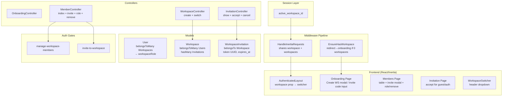

# Workspaces & Multi-User Auth Design

**Spec**: `.specs/features/workspaces-multiuser-auth/spec.md`
**Status**: Draft

---

## Architecture Overview

Workspace-first multi-tenancy via session-scoped context. Workspace é a entidade raiz — usuários pertencem a workspaces via pivot polimórfico, não o contrário. O workspace ativo é armazenado na sessão e compartilhado via Inertia como prop global. Toda query/rota financeira é automaticamente escopada ao workspace ativo.



**Key design decisions:**

| Decision | Choice | Rationale |
|----------|--------|-----------|
| Multi-tenancy pattern | Session-based workspace context | Simples, sem subdomains, adequado para SPA com Inertia. Sem pacote externo. |
| Workspace scoping | Global scope via trait `BelongsToWorkspace` | Automático, transparente. Aplica-se a todos os modelos financeiros futuros. |
| Authorization | Laravel Gates + `can:` middleware | Idiomático, testável, declarativo nas rotas. |
| Invitation token | UUID v4, single-use, expira em 7 dias | UUID previne enumeração. Single-use evita race conditions. Expiração evita tokens órfãos. |
| Workspace switcher | POST endpoint que atualiza sessão | Simples, stateless. Inertia recarrega a página com novo contexto. |
| Slug generation | `Str::slug()` + numeric suffix on conflict | Determinístico, legível, evita colisões. |

---

## Code Reuse Analysis

### Existing Components to Leverage

| Component | Location | How to Use |
|-----------|----------|------------|
| `HandleInertiaRequests` | `app/Http/Middleware/HandleInertiaRequests.php` | Extend `share()` to resolve active workspace + workspaces list from session |
| `AuthenticatedLayout` | `resources/js/Layouts/AuthenticatedLayout.tsx` | Add WorkspaceSwitcher to Header actions, update sidebar items |
| `Header` | `resources/js/Components/layout/Header.tsx` | Already has `actions` slot — WorkspaceSwitcher renders there |
| `Button` | `resources/js/Components/ui/Button.tsx` | Used in all modals, forms, and invite actions |
| `FormModal` | `resources/js/Components/ui/Modal/FormModal.tsx` | CreateWorkspaceModal, InviteModal |
| `ConfirmDialog` | `resources/js/Components/ui/Modal/ConfirmDialog.tsx` | Remove member confirmation, cancel invitation confirmation |
| `Table` | `resources/js/Components/ui/Table/Table.tsx` | Members list table with pagination and sorting |
| `TextInput` | `resources/js/Components/ui/Input/TextInput.tsx` | Workspace name/description fields, invite email field |
| `Select` | `resources/js/Components/ui/Input/Select.tsx` | Role selector dropdown (owner/editor) |
| `Alert` | `resources/js/Components/ui/Alert.tsx` | Empty states, error messages, invitation status |
| `PageTitle` | `resources/js/Components/layout/PageTitle.tsx` | Members page header |
| `toast` | `resources/js/lib/toast.ts` | Success/error feedback for all actions |
| `FontAwesomeIcon` | `resources/js/lib/icons.ts` | Icons for workspace switcher, members page, etc. |
| `UserFactory` | `database/factories/UserFactory.php` | Extend for test data generation with workspaces |

### Existing Patterns to Follow

| Pattern | Example | Apply To |
|---------|---------|----------|
| Inertia form submission | `Auth/Register.tsx` (useForm + post) | CreateWorkspace, Invite, AcceptInvitation |
| Controller → Inertia render | `ProfileController@edit` | OnboardingController, MemberController |
| Route → middleware → controller | `routes/web.php` `auth` + `verified` | `auth` + `workspace` + `can:...` |
| Migration structure | `0001_01_01_000000_create_users_table.php` | New workspace/invitation/pivot migrations |
| Test structure | `tests/Feature/Auth/RegistrationTest.php` (RefreshDatabase + HTTP assertions) | All workspace feature tests |

### Integration Points

| System | Integration Method |
|--------|-------------------|
| Existing auth (Breeze) | Modify `RegisteredUserController@store` to check invite token and auto-accept. Modify `AuthenticatedSessionController@store` to allow onboarding redirect. |
| User model | Add `workspaces()` BelongsToMany, `workspaceRole()`, `hasWorkspaces()` relationships |
| HandleInertiaRequests | Add workspace/workspaces props to `share()` |
| routes/web.php | Add workspace routes with new middleware aliases |

---

## Components

### Backend Components

#### Middleware: `EnsureHasWorkspace`

- **Purpose**: Redireciona para onboarding se usuário autenticado não tem nenhum workspace. Aplica-se a todas as rotas `auth` exceto onboarding e invite.
- **Location**: `app/Http/Middleware/EnsureHasWorkspace.php`
- **Interfaces**:
  - `handle(Request $request, Closure $next): Response`
- **Dependencies**: User model (needs `hasWorkspaces()` relationship)
- **Reuses**: N/A (novo)

```
WHEN user not authenticated THEN pass-through (let auth middleware handle it)
WHEN user has 0 workspaces AND route != 'onboarding' THEN redirect→route('onboarding')
WHEN user has 1+ workspaces THEN pass-through
```

#### Middleware Alias Registration

Registrar no `bootstrap/app.php`:
```php
$middleware->alias([
    'workspace' => \App\Http\Middleware\EnsureHasWorkspace::class,
]);
```

#### Updated: `HandleInertiaRequests`

- **Purpose**: Resolve o workspace ativo e lista de workspaces do usuário, compartilhando como props Inertia globais.
- **Location**: `app/Http/Middleware/HandleInertiaRequests.php` (update existing)
- **Reuses**: Self (extends)

Novo `share()` lógica:
```php
public function share(Request $request): array
{
    $user = $request->user();
    $workspace = null;
    $workspaces = [];

    if ($user) {
        $workspaces = $user->workspaces()
            ->orderBy('name')
            ->get()
            ->map(fn ($w) => [
                'id' => $w->id,
                'name' => $w->name,
                'slug' => $w->slug,
                'role' => $w->pivot->role,
            ]);

        $activeId = $request->session()->get('active_workspace_id');
        $workspace = $workspaces->firstWhere('id', $activeId);

        if (!$workspace && $workspaces->isNotEmpty()) {
            $workspace = $workspaces->first();
            $request->session()->put('active_workspace_id', $workspace['id']);
        }

        if ($workspace) {
            $request->attributes->set('active_workspace_id', $workspace['id']);
        }
    }

    return [
        ...parent::share($request),
        'auth' => ['user' => $user],
        'workspace' => $workspace,
        'workspaces' => $workspaces->toArray(),
    ];
}
```

#### Controller: `OnboardingController`

- **Purpose**: Renderiza tela de onboarding e processa criação de workspace inicial.
- **Location**: `app/Http/Controllers/OnboardingController.php`
- **Interfaces**:
  - `show(): Response` — renderiza `Onboarding` page (se usuário já tem workspaces, redireciona para dashboard)
  - `store(Request $request): RedirectResponse` — cria workspace, atribui owner, seta active, redireciona para dashboard
- **Dependencies**: Workspace model
- **Reuses**: Controller base

#### Controller: `WorkspaceController`

- **Purpose**: Cria workspace adicional e gerencia switching.
- **Location**: `app/Http/Controllers/WorkspaceController.php`
- **Interfaces**:
  - `store(Request $request): RedirectResponse` — cria workspace para usuário que já tem pelo menos um (owner, seta active)
  - `switch(Workspace $workspace, Request $request): RedirectResponse` — altera `active_workspace_id` na sessão
- **Dependencies**: Workspace model
- **Reuses**: Controller base

#### Controller: `MemberController`

- **Purpose**: Gerencia membros do workspace: listagem, convite, alteração de papel, remoção.
- **Location**: `app/Http/Controllers/MemberController.php`
- **Interfaces**:
  - `index(Request $request): Response` — renderiza `Workspace/Members` page com lista de membros + convites pendentes
  - `invite(InviteMemberRequest $request): JsonResponse` — gera invitation token, envia email (se fornecido), retorna link
  - `updateRole(Member $user, UpdateMemberRoleRequest $request): RedirectResponse` — altera papel de um membro
  - `destroy(Member $user, Request $request): RedirectResponse` — remove membro do workspace
  - `cancelInvitation(WorkspaceInvitation $invitation): RedirectResponse` — cancela convite pendente
- **Dependencies**: Workspace (via session), User, WorkspaceInvitation
- **Reuses**: Controller base, Gates for authorization

#### Controller: `InvitationController`

- **Purpose**: Exibe página de aceitação de convite e processa aceitação.
- **Location**: `app/Http/Controllers/InvitationController.php`
- **Interfaces**:
  - `show(string $token): Response` — valida token, renderiza `Invitation/Accept` com workspace name
  - `accept(string $token, Request $request): RedirectResponse` — aceita convite, adiciona usuário como editor, seta como active workspace
- **Dependencies**: WorkspaceInvitation model
- **Reuses**: Controller base

#### Updated: `RegisteredUserController`

- **Purpose**: Modificar `store()` para detectar `invite_token` na request e auto-aceitar convite após registro.
- **Location**: `app/Http/Controllers/Auth/RegisteredUserController.php` (update existing)
- **Changes**: Após `Auth::login($user)`, verificar `$request->invite_token`. Se válido → aceitar invite → redirect dashboard. Se inválido → redirect onboarding.
- **Reuses**: Self (extends)

#### Updated: `AuthenticatedSessionController`

- **Purpose**: Modificar `store()` para redirecionar para onboarding se usuário não tem workspaces.
- **Location**: `app/Http/Controllers/Auth/AuthenticatedSessionController.php` (update existing)
- **Changes**: Após `$request->authenticate()`, verificar `$request->user()->hasWorkspaces()`. Se não tem → redirect onboarding. Se tem → intended(route('dashboard')).
- **Reuses**: Self (extends)

#### Request: `InviteMemberRequest`

- **Purpose**: Validação do formulário de convite.
- **Location**: `app/Http/Requests/InviteMemberRequest.php`
- **Interfaces**: `rules(): array` — `email` optional, valid email format

#### Request: `UpdateMemberRoleRequest`

- **Purpose**: Validação da alteração de papel.
- **Location**: `app/Http/Requests/UpdateMemberRoleRequest.php`
- **Interfaces**: `rules(): array` — `role` required, in:owner,editor

#### Mail: `WorkspaceInvitationMail`

- **Purpose**: Email com link de convite.
- **Location**: `app/Mail/WorkspaceInvitationMail.php`
- **Reuses**: Laravel Mailable com template Blade simples (texto + link)

#### Gates (Registered in `AppServiceProvider@boot`)

```php
Gate::define('manage-workspace-members', fn (User $user) =>
    $user->workspaceRole(active_workspace()) === 'owner'
);

Gate::define('invite-to-workspace', fn (User $user) =>
    $user->workspaceRole(active_workspace()) === 'owner'
);
```

Helper `active_workspace()` no mesmo provider ou em um helper global:
```php
function active_workspace(): ?Workspace
{
    $id = session('active_workspace_id') ?? request()->attributes->get('active_workspace_id');
    return $id ? Workspace::find($id) : null;
}
```

---

### Frontend Components

#### Page: `Onboarding.tsx`

- **Purpose**: Tela pós-registro com duas opções: criar workspace ou entrar com código de convite.
- **Location**: `resources/js/Pages/Onboarding.tsx`
- **Interfaces**: Usa `usePage().props.workspace` para detectar se já tem workspace (bypass).
- **Dependencies**: `GuestLayout`, `Button`, `TextInput`, `FormModal`
- **Reuses**: Padrão de form Inertia (`useForm`)

#### Page: `Workspace/Members.tsx`

- **Purpose**: Página de gerenciamento de membros com tabela, convites pendentes, ações de alterar papel e remover.
- **Location**: `resources/js/Pages/Workspace/Members.tsx`
- **Interfaces**: Recebe props: `members: Member[]`, `pendingInvitations: Invitation[]`, `canManageMembers: boolean`
- **Dependencies**: `AuthenticatedLayout`, `Table`, `PageTitle`, `Button`, `ConfirmDialog`, `Select`
- **Reuses**: Table padronizado (mesma API)

#### Page: `Invitation/Accept.tsx`

- **Purpose**: Página de aceitação de convite para guest e usuários logados.
- **Location**: `resources/js/Pages/Invitation/Accept.tsx`
- **Interfaces**: Recebe props: `workspaceName: string`, `token: string`, `isAuthenticated: boolean`, `isAlreadyMember: boolean`
- **Dependencies**: `GuestLayout` (guest) ou redirecionamento (auth)
- **Reuses**: N/A

#### Component: `WorkspaceSwitcher.tsx`

- **Purpose**: Dropdown no header para alternar workspace ativo.
- **Location**: `resources/js/Components/workspace/WorkspaceSwitcher.tsx`
- **Interfaces**: Usa `usePage().props.workspaces` e `usePage().props.workspace` para state. POST para `route('workspace.switch', workspace.id)`.
- **Dependencies**: Headless UI `Menu` (ou Dropdown existente adaptado), `FontAwesomeIcon` (faBuilding, faChevronDown)
- **Reuses**: Estilo similar ao Dropdown existente do Breeze

**Comportamento**:
```
IF workspaces.length === 0 → não renderiza (não deveria acontecer com EnsureHasWorkspace)
IF workspaces.length === 1 → mostra nome como label não-interativo
IF workspaces.length > 1 → dropdown com lista de workspaces, workspace ativo destacado
ON click → POST /switch-workspace/{id} → Inertia.reload()
```

#### Component: `CreateWorkspaceModal.tsx`

- **Purpose**: Modal com formulário de criação de workspace.
- **Location**: `resources/js/Components/workspace/CreateWorkspaceModal.tsx`
- **Interfaces**: Props: `open: boolean`, `onClose: () => void`. `useForm` com `name` (required) e `description` (optional).
- **Dependencies**: `FormModal`, `TextInput`, `Textarea`
- **Reuses**: Padrão `useForm` do Inertia

#### Component: `InviteModal.tsx`

- **Purpose**: Modal para gerar e compartilhar link de convite.
- **Location**: `resources/js/Components/workspace/InviteModal.tsx`
- **Interfaces**: Props: `open: boolean`, `onClose: () => void`. State interno: `inviteLink: string | null`, `copied: boolean`.
- **Dependencies**: `FormModal`, `TextInput` (email opcional), `Button`
- **Reuses**: `navigator.clipboard.writeText()` para copy-to-clipboard, `toast.success()` para feedback

---

## Data Models

### Workspace

**Table**: `workspaces`
**Columns**:
| Column | Type | Constraints |
|--------|------|-------------|
| id | bigint unsigned | auto-increment, primary |
| name | string(255) | not null |
| slug | string(255) | not null, unique |
| description | text | nullable |
| created_at | timestamp | |
| updated_at | timestamp | |

```php
// app/Models/Workspace.php
#[Fillable(['name', 'slug', 'description'])]
class Workspace extends Model
{
    public function users(): BelongsToMany
    {
        return $this->belongsToMany(User::class, 'workspace_user')
            ->withPivot('role')
            ->withTimestamps();
    }

    public function invitations(): HasMany
    {
        return $this->hasMany(WorkspaceInvitation::class);
    }

    public static function boot(): void
    {
        parent::boot();
        static::creating(function (Workspace $workspace) {
            if (empty($workspace->slug)) {
                $workspace->slug = static::generateUniqueSlug($workspace->name);
            }
        });
    }

    public static function generateUniqueSlug(string $name): string
    {
        $slug = Str::slug($name);
        $original = $slug;
        $counter = 2;
        while (static::where('slug', $slug)->exists()) {
            $slug = $original . '-' . $counter++;
        }
        return $slug;
    }

    public function owners(): BelongsToMany
    {
        return $this->belongsToMany(User::class, 'workspace_user')
            ->wherePivot('role', 'owner')
            ->withPivot('role')
            ->withTimestamps();
    }
}
```

### Workspace-User Pivot

**Table**: `workspace_user`
**Columns**:
| Column | Type | Constraints |
|--------|------|-------------|
| workspace_id | bigint unsigned | FK → workspaces(id), onDelete cascade |
| user_id | bigint unsigned | FK → users(id), onDelete cascade |
| role | string(20) | default: 'editor', values: 'owner' or 'editor' |
| created_at | timestamp | |
| updated_at | timestamp | |

**Primary key**: composite `(workspace_id, user_id)`

### User (Updated)

```php
// Add to app/Models/User.php
#[Fillable(['name', 'email', 'password'])]
#[Hidden(['password', 'remember_token'])]
class User extends Authenticatable
{
    use HasFactory, Notifiable;

    public function workspaces(): BelongsToMany
    {
        return $this->belongsToMany(Workspace::class, 'workspace_user')
            ->withPivot('role')
            ->withTimestamps();
    }

    public function workspaceRole(Workspace $workspace): ?string
    {
        return $this->workspaces()
            ->where('workspace_id', $workspace->id)
            ->first()?->pivot
            ->role;
    }

    public function isOwnerOf(Workspace $workspace): bool
    {
        return $this->workspaceRole($workspace) === 'owner';
    }

    public function hasWorkspaces(): bool
    {
        return $this->workspaces()->exists();
    }
}
```

### WorkspaceInvitation

**Table**: `workspace_invitations`
**Columns**:
| Column | Type | Constraints |
|--------|------|-------------|
| id | bigint unsigned | auto-increment, primary |
| workspace_id | bigint unsigned | FK → workspaces(id), onDelete cascade |
| created_by | bigint unsigned | FK → users(id), onDelete cascade |
| token | string(64) | not null, unique (UUID v4) |
| email | string(255) | nullable (link can be shared without email) |
| accepted_at | timestamp | nullable |
| cancelled_at | timestamp | nullable |
| expires_at | timestamp | not null, default: now() + 7 days |
| created_at | timestamp | |
| updated_at | timestamp | |

```php
// app/Models/WorkspaceInvitation.php
#[Fillable(['email', 'token', 'expires_at'])]
class WorkspaceInvitation extends Model
{
    protected function casts(): array
    {
        return [
            'accepted_at' => 'datetime',
            'cancelled_at' => 'datetime',
            'expires_at' => 'datetime',
        ];
    }

    public function workspace(): BelongsTo
    {
        return $this->belongsTo(Workspace::class);
    }

    public function createdBy(): BelongsTo
    {
        return $this->belongsTo(User::class, 'created_by');
    }

    public function isAccepted(): bool
    {
        return $this->accepted_at !== null;
    }

    public function isCancelled(): bool
    {
        return $this->cancelled_at !== null;
    }

    public function isExpired(): bool
    {
        return $this->expires_at->isPast();
    }

    public function isValid(): bool
    {
        return !$this->isAccepted()
            && !$this->isCancelled()
            && !$this->isExpired();
    }
}
```

### Future: `BelongsToWorkspace` Trait

Trait a ser criada como parte deste feature para uso por modelos financeiros futuros (F02-F06). Auto-escopa queries pelo `active_workspace_id` da sessão.

```php
// app/Models/Concerns/BelongsToWorkspace.php
trait BelongsToWorkspace
{
    public static function bootBelongsToWorkspace(): void
    {
        static::addGlobalScope('workspace', function (Builder $builder) {
            $workspaceId = session('active_workspace_id')
                ?? request()->attributes->get('active_workspace_id');

            if ($workspaceId) {
                $builder->where($builder->getModel()->getTable() . '.workspace_id', $workspaceId);
            }
        });

        static::creating(function (Model $model) {
            if (!$model->workspace_id) {
                $model->workspace_id = session('active_workspace_id')
                    ?? request()->attributes->get('active_workspace_id');
            }
        });
    }
}
```

---

## Route Design

### New Routes (routes/web.php)

```php
use App\Http\Controllers\OnboardingController;
use App\Http\Controllers\WorkspaceController;
use App\Http\Controllers\MemberController;
use App\Http\Controllers\InvitationController;

// Guest-accessible invite page
Route::get('/invite/{token}', [InvitationController::class, 'show'])
    ->name('invitation.show');

// Auth routes that DON'T require workspace
Route::middleware('auth')->group(function () {
    // Onboarding
    Route::get('/onboarding', [OnboardingController::class, 'show'])
        ->name('onboarding');
    Route::post('/workspaces', [WorkspaceController::class, 'store'])
        ->name('workspaces.store');

    // Invite acceptance (auth required to accept)
    Route::post('/invite/{token}/accept', [InvitationController::class, 'accept'])
        ->name('invitation.accept');
});

// Auth routes that REQUIRE workspace + onboarding gate
Route::middleware(['auth', 'workspace'])->group(function () {
    // Dashboard
    Route::get('/dashboard', fn () => Inertia::render('Dashboard'))
        ->middleware('verified')
        ->name('dashboard');

    // Profile (existing, moved into workspace group to inherit workspace gate)
    Route::get('/profile', [ProfileController::class, 'edit'])->name('profile.edit');
    Route::patch('/profile', [ProfileController::class, 'update'])->name('profile.update');
    Route::delete('/profile', [ProfileController::class, 'destroy'])->name('profile.destroy');

    // Workspace management (owner-only actions)
    Route::prefix('/workspace')->name('workspace.')->group(function () {
        Route::get('/members', [MemberController::class, 'index'])
            ->name('members')
            ->middleware('can:manage-workspace-members');

        Route::post('/invite', [MemberController::class, 'invite'])
            ->name('invite')
            ->middleware('can:invite-to-workspace');

        Route::patch('/members/{user}', [MemberController::class, 'updateRole'])
            ->name('members.update-role')
            ->middleware('can:manage-workspace-members');

        Route::delete('/members/{user}', [MemberController::class, 'destroy'])
            ->name('members.destroy')
            ->middleware('can:manage-workspace-members');

        Route::delete('/invitations/{invitation}', [MemberController::class, 'cancelInvitation'])
            ->name('invitations.destroy')
            ->middleware('can:manage-workspace-members');
    });

    // Workspace switching
    Route::post('/switch-workspace/{workspace}', [WorkspaceController::class, 'switch'])
        ->name('workspace.switch');
});
```

### Middleware Registration (bootstrap/app.php)

```php
->withMiddleware(function (Middleware $middleware): void {
    $middleware->web(append: [
        \App\Http\Middleware\HandleInertiaRequests::class,
        \Illuminate\Http\Middleware\AddLinkHeadersForPreloadedAssets::class,
    ]);

    $middleware->alias([
        'workspace' => \App\Http\Middleware\EnsureHasWorkspace::class,
    ]);
})
```

### Redirect Flow Summary

```
REGISTER ──► (has invite token?) ──YES──► accept invite ──► /dashboard
                │
                NO
                │
                ▼
            /onboarding (create workspace)

LOGIN ──► (has workspaces?) ──YES──► /dashboard
              │
              NO
              │
              ▼
          /onboarding

LOGOUT ──► /
```

---

## Error Handling Strategy

| Error Scenario | Handling | User Impact |
|---------------|----------|-------------|
| Invite token inválido/não encontrado | 404 page via `abort(404, 'Convite não encontrado')` | Página de erro "Convite inválido ou expirado" |
| Invite token expirado | `isValid()` check → status: 'expired' → renderiza mensagem específica | Página com mensagem "Este convite expirou. Peça um novo convite ao proprietário." |
| Invite token já aceito | Se logged-in user is already member → "Você já faz parte deste workspace". Se outro user → "Este convite já foi aceito." | Mensagem informativa, sem ação disponível |
| Invite token cancelado | `isCancelled()` check → status: 'cancelled' | Página com mensagem "Este convite foi cancelado pelo proprietário." |
| Remover último owner | Validation: `workspace->owners()->count() <= 1` → 422 | Toast "Workspace precisa ter pelo menos um proprietário" |
| Owner tenta se demote | Validation: `target is self AND role == 'editor' AND would leave 0 owners` → 422 | Toast "Não é possível remover seu próprio papel de proprietário" |
| Email send fails (SMTP down) | Try-catch no `InviteMemberRequest` handler → log error, still return link | Usuário vê o link de convite (fallback: copiar manualmente). Email failure é logged. |
| Rate limit no invite accept | `throttle:10,1` middleware na rota `/invite/{token}` | 429 Too Many Requests |
| User sem workspace tenta acessar rota protegida | `EnsureHasWorkspace` redirect → `/onboarding` | Redirecionamento transparente |
| Editor tenta acessar rota de gerenciamento de membros | Gate `manage-workspace-members` → 403 | Página 403 padrão (ou Inertia error page) |
| Duas requisições simultâneas aceitam mesmo invite | DB transaction + unique constraint check on accept | Segundo request falha com erro de validação |
| Workspace slug collision | `generateUniqueSlug()` appends `-2`, `-3`, etc. | Slug único gerado automaticamente, transparente para o usuário |

---

## Test Design

### Test Structure

```
tests/
├── Feature/
│   ├── Workspace/
│   │   ├── CreateWorkspaceTest.php     # WS-01, WS-02, WS-04
│   │   ├── OnboardingGateTest.php      # WS-03
│   │   ├── WorkspaceSwitchTest.php     # WS-11, WS-12, WS-13
│   │   ├── InviteTest.php             # WS-06, WS-07, WS-10
│   │   ├── AcceptInviteTest.php       # WS-08, WS-23, WS-24
│   │   ├── CancelInviteTest.php       # WS-09
│   │   ├── MemberManagementTest.php   # WS-15, WS-16, WS-18, WS-19
│   │   └── RoleAuthorizationTest.php  # WS-14, WS-15
│   └── Auth/
│       ├── RegistrationWithInviteTest.php  # WS-22
│       └── LoginRedirectTest.php
└── Unit/
    ├── WorkspaceSlugTest.php          # WS-04
    ├── InvitationValidationTest.php   # WS-10
    └── BelongsToWorkspaceTest.php     # (trait test, future use)
```

### Test Cases

#### Workspace Creation (CreateWorkspaceTest)

**Test type**: feature (HTTP)
**Test framework**: phpunit

| # | Test Case | Maps to AC | Input | Expected Output/Behavior |
|---|-----------|-----------|-------|-------------------------|
| 1 | User creates workspace with valid name | P1-AC3, P1-AC4 | `{name: 'Minhas Finanças'}` | 201, workspace created, user is owner, redirect dashboard |
| 2 | Slug is auto-generated from name | P1-AC7 | `{name: 'Minhas Finanças'}` | slug = 'minhas-financas' |
| 3 | Slug collision appends numeric suffix | Edge Case | `{name: 'Test'}` twice | first slug='test', second='test-2' |
| 4 | Name is required | P1-AC3 | `{name: ''}` | 422, validation error |
| 5 | Name max 255 chars | P1-AC3 | `{name: str_repeat('a', 256)}` | 422 |
| 6 | Slug truncation for excessively long names | Edge Case | `{name: 200 chars}` | slug ≤ 255 chars |
| 7 | Onboarding bypassed if user already has 1+ workspaces | P1-AC5 | GET /onboarding with workspace | redirect to /dashboard |
| 8 | Guest cannot access onboarding | - | GET /onboarding unauthenticated | redirect to /login |

#### Onboarding Gate (OnboardingGateTest)

**Test type**: feature
**Test framework**: phpunit

| # | Test Case | Maps to AC | Input | Expected Output/Behavior |
|---|-----------|-----------|-------|-------------------------|
| 1 | New user without workspace redirected to onboarding | P1-AC1, P1-AC6 | GET /dashboard after register (no WS) | redirect /onboarding |
| 2 | User with workspace can access /dashboard | P1-AC5 | GET /dashboard with WS | 200 |
| 3 | User without workspace can access /onboarding | P1-AC2 | GET /onboarding | 200 |
| 4 | User with workspace redirected from /onboarding to /dashboard | P1-AC5 | GET /onboarding with WS | redirect /dashboard |

#### Workspace Invitation (InviteTest)

**Test type**: feature
**Test framework**: phpunit

| # | Test Case | Maps to AC | Input | Expected Output/Behavior |
|---|-----------|-----------|-------|-------------------------|
| 1 | Owner can generate invitation | P2-AC2, P2-AC3 | POST /workspace/invite | 200, returns `invite_link` with token |
| 2 | Invitation link includes valid UUID token | P2-AC2 | POST /workspace/invite | link = `/invite/{uuid}` with valid UUID |
| 3 | Owner can optionally provide email | P2-AC4 | POST /workspace/invite with email | email sent via WorkspaceInvitationMail |
| 4 | Editor cannot generate invitation | P4-AC4 | POST /workspace/invite as editor | 403 |
| 5 | Invite link is copyable (frontend behavior) | P2-AC3 | render InviteModal | copy-to-clipboard button present |
| 6 | Email failure still returns link | Edge Case | POST with email, SMTP off | 200, link returned, email error logged |

#### Accept Invitation (AcceptInviteTest)

**Test type**: feature
**Test framework**: phpunit

| # | Test Case | Maps to AC | Input | Expected Output/Behavior |
|---|-----------|-----------|-------|-------------------------|
| 1 | Authenticated user can accept valid invite | P2-AC5, P2-AC6 | POST /invite/{token}/accept | redirect /dashboard, user is editor |
| 2 | New user registers with invite token and auto-joins | P6-AC1, P6-AC3 | POST /register with invite_token | redirect /dashboard, workspace has 2 members |
| 3 | Invalid token shows error page | P2-AC8 | GET /invite/invalid-token | 404, "Convite inválido ou expirado" |
| 4 | Expired token shows specific error | P2-AC8 | GET /invite/{expired-token} | status: 'expired', specific message |
| 5 | Already accepted invite shows message | P2-AC9 | GET /invite/{used-token} | "Você já faz parte deste workspace" |
| 6 | Cancelled invite shows message | Edge Case | GET /invite/{cancelled-token} | "Convite cancelado" |
| 7 | Concurrent acceptance only succeeds once | Edge Case | 2 parallel POST /invite/{token}/accept | one 200, one 409/422 |
| 8 | Rate limiting on invite page | Edge Case | 11 GET /invite/{token}/minute from same IP | 429 on 11th |

#### Cancel Invitation (CancelInviteTest)

**Test type**: feature
**Test framework**: phpunit

| # | Test Case | Maps to AC | Input | Expected Output/Behavior |
|---|-----------|-----------|-------|-------------------------|
| 1 | Owner can cancel pending invitation | P2-AC10 | DELETE /workspace/invitations/{id} | 200, invitation cancelled_at set |
| 2 | Editor cannot cancel invitation | P2-AC10 | DELETE as editor | 403 |
| 3 | Cancelled invite link shows "cancelado" | Edge Case | GET /invite/{cancelled-token} | "Convite cancelado" |

#### Workspace Switching (WorkspaceSwitchTest)

**Test type**: feature
**Test framework**: phpunit

| # | Test Case | Maps to AC | Input | Expected Output/Behavior |
|---|-----------|-----------|-------|-------------------------|
| 1 | User with multiple workspaces can switch | P3-AC2 | POST /switch-workspace/{id} | session active_workspace_id updated, redirect back |
| 2 | User with single workspace sees label (not dropdown) | P3-AC3 | shared props: workspaces.length === 1 | workspace switcher renders as non-interactive label |
| 3 | User with multiple workspaces sees dropdown | P3-AC1 | shared props: workspaces.length > 1 | dropdown rendered |
| 4 | Cannot switch to workspace user doesn't belong to | P3-AC4 | POST /switch-workspace/{other-ws-id} | 403 |
| 5 | Login restores last active workspace from session | P3-AC5 | login after switching | active_workspace_id preserved |
| 6 | Login with no active session defaults to first workspace alphabetically | P3-AC5 | fresh login, no active_workspace_id | first alphabetical workspace is active |

#### Member Management (MemberManagementTest)

**Test type**: feature
**Test framework**: phpunit

| # | Test Case | Maps to AC | Input | Expected Output/Behavior |
|---|-----------|-----------|-------|-------------------------|
| 1 | Owner can view members list | P5-AC1 | GET /workspace/members | 200, members list with role, email, joined date |
| 2 | Editor cannot view members list | P4-AC3 | GET /workspace/members as editor | 403 |
| 3 | Owner can change member role to owner | P5-AC2 | PATCH /workspace/members/{id}, role=owner | 200, role updated |
| 4 | Owner can change member role to editor | P5-AC2 | PATCH /workspace/members/{id}, role=editor | 200, role updated |
| 5 | Owner cannot demote self if last owner | P4-AC5 | PATCH self, role=editor (last owner) | 422 |
| 6 | Owner can demote self if another owner exists | P4-AC5 | PATCH self with co-owner present | 200 |
| 7 | Owner can remove member | P5-AC3 | DELETE /workspace/members/{id} | 200, member removed |
| 8 | Owner cannot remove last owner | P4-AC6 | DELETE last owner | 422 |
| 9 | Editor cannot remove any member | P4-AC4 | DELETE as editor | 403 |
| 10 | Editor cannot change roles | P4-AC4 | PATCH as editor | 403 |

#### Role Authorization (RoleAuthorizationTest)

**Test type**: feature
**Test framework**: phpunit

| # | Test Case | Maps to AC | Input | Expected Output/Behavior |
|---|-----------|-----------|-------|-------------------------|
| 1 | Owner can perform all member management actions | P4-AC1 | All CRUD on members as owner | All 200 |
| 2 | Editor cannot access member management routes | P4-AC2 | GET/POST/PATCH/DELETE as editor | All 403 |
| 3 | Owner can access CRUD on financial entities (future) | P4-AC2 | GET /accounts, etc. | 200 |
| 4 | Editor can access CRUD on financial entities (future) | P4-AC2 | GET /accounts, etc. | 200 |

#### Registration with Invite (RegistrationWithInviteTest)

**Test type**: feature
**Test framework**: phpunit

| # | Test Case | Maps to AC | Input | Expected Output/Behavior |
|---|-----------|-----------|-------|-------------------------|
| 1 | Register with valid invite token auto-joins workspace | P6-AC3 | POST /register + invite_token | redirect /dashboard, user is editor in workspace |
| 2 | Register with invalid invite token goes to onboarding | P6-AC4 | POST /register + invalid_token | redirect /onboarding, account created, no workspace |
| 3 | Register without invite token goes to onboarding | P1-AC1 | POST /register (no invite_token) | redirect /onboarding |

#### Workspace Slug Generation (WorkspaceSlugTest)

**Test type**: unit
**Test framework**: phpunit

| # | Test Case | Maps to AC | Input | Expected Output/Behavior |
|---|-----------|-----------|-------|-------------------------|
| 1 | Simple name generates correct slug | WS-04 | 'Minhas Finanças' | 'minhas-financas' |
| 2 | Special characters are removed | WS-04 | 'Casa & Família!' | 'casa-familia' |
| 3 | Duplicate slug appends '-2' | Edge Case | 'Test' when slug exists | 'test-2' |
| 4 | Multiple duplicates increment correctly | Edge Case | 'Test' when 'test', 'test-2' exist | 'test-3' |

#### Invitation Validation (InvitationValidationTest)

**Test type**: unit
**Test framework**: phpunit

| # | Test Case | Maps to AC | Input | Expected Output/Behavior |
|---|-----------|-----------|-------|-------------------------|
| 1 | isValid returns true for fresh invitation | WS-10 | new invitation | true |
| 2 | isValid returns false when expired | WS-10 | invitation with past expires_at | false |
| 3 | isValid returns false when accepted | WS-10 | invitation with accepted_at set | false |
| 4 | isValid returns false when cancelled | WS-10 | invitation with cancelled_at set | false |

---

## Migration Plan

**Ordered migration files:**

1. `2026_05_05_000001_create_workspaces_table.php` — workspaces table
2. `2026_05_05_000002_create_workspace_user_table.php` — pivot table
3. `2026_05_05_000003_create_workspace_invitations_table.php` — invitations table

---

## Inertia Shared Props Contract

```typescript
// resources/js/types/workspace.d.ts (NEW)
interface WorkspaceProps {
  id: number
  name: string
  slug: string
  role: 'owner' | 'editor'
}

interface SharedProps {
  auth: { user: App.Data.User | null }
  workspace: WorkspaceProps | null  // active workspace (null if no workspaces)
  workspaces: WorkspaceProps[]      // all user's workspaces (empty if none)
}

// Extend @inertiajs/react PageProps
declare module '@inertiajs/react' {
  interface PageProps extends SharedProps {}
}
```

---

## Frontend Integration Points

### AuthenticatedLayout Changes

```
AuthenticatedLayout
├── AppShell
│   ├── Sidebar (unchanged structure)
│   │   ├── Nav items (future: workspace-scoped links)
│   │   └── footer (user name)
│   └── Header
│       ├── children (breadcrumbs, etc.)
│       └── actions
│           ├── [NEW] WorkspaceSwitcher (before user dropdown)
│           └── Dropdown (user menu — existing)
```

The `actions` slot in Header currently contains the user Dropdown. WorkspaceSwitcher is inserted to the left of it.

### Guest vs Authenticated Layouts

- `GuestLayout`: Used for Login, Register, ForgotPassword, ResetPassword, ConfirmPassword, VerifyEmail, **Invitation/Accept (guest view)**
- `AuthenticatedLayout`: Used for Dashboard, Profile, **Onboarding**, **Workspace/Members**, all future feature pages

Note: Onboarding uses AuthenticatedLayout (user is logged in but has no workspace). The sidebar will be empty/minimal, and the workspace switcher won't render (no workspaces).

---

## Tech Decisions

| Decision | Choice | Rationale |
|----------|--------|-----------|
| Multi-tenancy package | None (custom) | Escopo simples: apenas workspace_id. Pacotes como stancl/tenancy são overkill para multi-tenant sem subdomínios. |
| Auth redirection after login | Check workspaces count in AuthenticatedSessionController | Simples, evita middleware extra para login flow. |
| Active workspace resolution | HandleInertiaRequests.share() | Centralizado, roda em toda request, evita duplicação. Props disponíveis em qualquer page. |
| Gates vs Policies | Gates (simples) | Ações são baseadas em role global, não em model específico. Gates são mais diretas que Policies para este caso. |
| Invite email | Laravel Mail facade + Mailable class | Padrão Laravel. Sem dependência extra. SMTP config já existente. |
| Role enum | String column com validação | Simples, legível, fácil de estender com novos papéis. Sem necessidade de Enum PHP 8.1+ (migração trivial depois). |
| Session driver | Default (file/database based on env) | Já configurado, suporta `active_workspace_id`. Sem mudanças. |
| Workspace switcher UX | Inertia POST + reload | Alternar workspace recarrega a página com novo contexto. Evita reactivity complexa. |
| Copy-to-clipboard | `navigator.clipboard.writeText()` nativo | Sem dependência extra. Suporte universal em browsers modernos. |
| Invite accept for new users | Query param `?invite_token=` on register | Token preservado na URL durante o fluxo de registro. Não requer session/cookie. |
